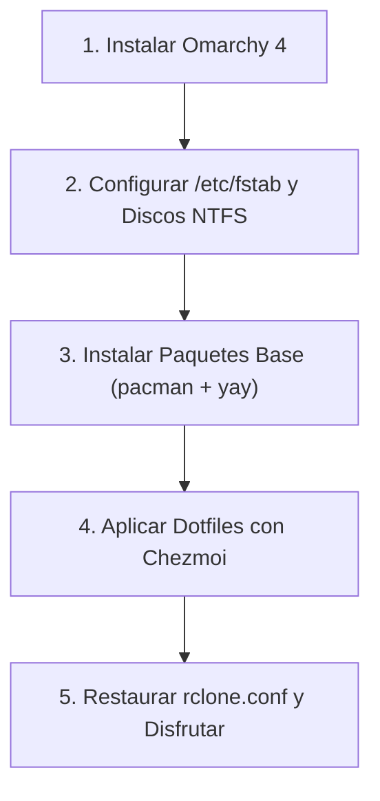

# 🚀 Omarchy 4 Dotfiles & Workstation Configuration

Repositorio integral de configuración, dotfiles y utilitarios para **Omarchy 4** (Arch Linux con Hyprland y arquitectura modular en Lua), gestionado con **[Chezmoi](https://www.chezmoi.io/)**.

---

## 📦 Inventario de Aplicaciones y Dependencias (Por Categoría)

Para que todos los atajos de teclado, scripts y lanzadores funcionen al 100% en una instalación limpia, este es el stack de software categorizado:

### 1. Herramientas de Atajos Dedicados & Audio (AUR / Pacman)
*Requeridos por los atajos de Hyprland (`bindings.lua`) y scripts de control (`~/.local/bin/`):*
* **`omacalc`** (AUR): Calculadora flotante nativa en Qt Quick $\rightarrow$ atajo `SUPER + ALT + C`.
* **`cliamp`** (AUR): Reproductor de audio retro Winamp para terminal $\rightarrow$ atajo `SUPER + R`.
* **`voxtype-bin`** (AUR): Dictado por voz Push-to-Talk y traducción en tiempo real $\rightarrow$ atajos `F9` (dictado ES) y `F10` (traducción EN).
* **`mpv` & `imv`**: Reproductor multimedia y visor ligero de imágenes.

```bash
yay -S --needed omacalc cliamp voxtype-bin mpv imv
```

### 2. Almacenamiento, FUSE & Nube
*Requeridos para montar unidades locales NTFS fijas y sincronizar Google Drive con Rclone:*
* **`rclone` & `fuse3`**: Motor de sincronización y montaje en espacio de usuario.
* **`ntfs-3g`**: Soporte de lectura y escritura para discos físicos Windows (`/mnt/DATOS-2TB`, `/mnt/BACKUP-1TB`, `/mnt/BACKUP-4TB`).
* **`python-gobject`**: Resuelve dependencias de extensiones de Nautilus y previene bloqueos.

```bash
sudo pacman -S --needed rclone fuse3 ntfs-3g python-gobject
```

### 3. Ofimática, Fuentes & Documentos
*Compatibilidad nativa con documentos de Microsoft 365 y visualización tipográfica idéntica:*
* **`onlyoffice-bin`** (AUR): Suite ofimática predeterminada para docx, xlsx, pptx.
* **Fuentes Microsoft**: `ttf-ms-fonts`, `ttf-vista-fonts`, `ttf-aptos-fonts`.

```bash
yay -S --needed onlyoffice-bin ttf-ms-fonts ttf-vista-fonts ttf-aptos-fonts
fc-cache -fv
```

### 4. Desarrollo, Terminal & Runtimes
* **`docker` & `docker-compose`**: Contenedores para desarrollo.
* **Herramientas CLI Rust**: `btop` (monitoreo), `fd` (búsqueda de archivos), `ripgrep` (búsqueda de código), `bat` (visualizador con resaltado).
* **Runtimes centralizados con `mise`**:
  * Node.js (26.7.0), Java (Temurin-25 LTS), Bun, Go, Python, Deno, pnpm, chezmoi.
  *(Se instalan de forma desatendida vía el hook automático `03_mise.sh` al sincronizar este repositorio).*

```bash
sudo pacman -S --needed btop fd ripgrep bat docker docker-compose
sudo usermod -aG docker $USER
```

---

## 🌐 Webapps Integradas de Omarchy 4

> [!NOTE]
> **¡Ya están incluidas en este repositorio!**
> Todos los archivos `.desktop` (`~/.local/share/applications/`) y sus iconos de alta resolución en 256x256 (`~/.local/share/icons/hicolor/256x256/apps/`) están versionados en Chezmoi. Al ejecutar `chezmoi apply`, aparecerán de inmediato en tu lanzador de aplicaciones.

### Catálogo de Webapps Versionadas:
* **Productividad & Google Workspace:**
  * Google Gemini (`SUPER + SHIFT + A`), Gemini NotebookLM
  * Google Gmail, Google Calendar, Google Keep, Google Tasks, Google Contacts
  * Google Drive (Personal) y Google Drive ABC
  * Google Meet, Google Translate, Google Sheets (con handler propio en `~/.local/bin/open-google-sheet`), Google Vids, Google Books
* **Comunicación & Redes:**
  * WhatsApp Web (`SUPER + ALT + M`)
  * YouTube & YouTube Music (`SUPER + M`)
  * Discord, Zoom, HEY, Basecamp, Facebook, X (Twitter)
* **Educación & Desarrollo:**
  * DevTalles, Udemy, GitHub, Microsoft OneDrive

### ¿Cómo registrar una nueva Webapp en el futuro?
Si instalas una webapp adicional usando la herramienta de Omarchy:
```bash
omarchy-webapp-install "NombreApp" "https://url-de-la-app.com" "icono.png"
# Para respaldarla en este repositorio:
chezmoi add ~/.local/share/applications/NombreApp.desktop
chezmoi add ~/.local/share/icons/hicolor/256x256/apps/nombreapp.png
chezmoi git commit -m "feat(webapp): agregar NombreApp" && chezmoi git push
```

---

## 🔄 Protocolo de Restauración desde Cero (Disaster Recovery)

Si reinstalas el sistema de cero:



### Paso 1: Sistema Base
Instalar Omarchy 4 desde la ISO oficial y reiniciar.

### Paso 2: Discos Físicos (/etc/fstab)
Crear los puntos de montaje y configurar `/etc/fstab` (según `omarchy4-storage-workflow-runbook.md`):
```bash
sudo mkdir -p /mnt/DATOS-2TB /mnt/BACKUP-1TB /mnt/BACKUP-4TB
sudo mount -a
```

### Paso 3: Paquetes y Dependencias
Instalar todos los paquetes agrupados:
```bash
# Pacman:
sudo pacman -S --needed rclone fuse3 ntfs-3g python-gobject btop fd ripgrep bat docker docker-compose mpv imv
sudo usermod -aG docker $USER

# AUR (yay):
yay -S --needed omacalc cliamp voxtype-bin onlyoffice-bin ttf-ms-fonts ttf-vista-fonts ttf-aptos-fonts
fc-cache -fv
```

### Paso 4: Desplegar Dotfiles con Chezmoi
```bash
# 1. Instalar chezmoi (vía mise o pacman)
mise use -g chezmoi || sudo pacman -S chezmoi

# 2. Inicializar y aplicar todo tu entorno en 1 solo paso:
chezmoi init --apply https://github.com/lumusitech/dotfiles.git
```
*Chezmoi ejecutará los scripts automáticos para:*
* Sincronizar todos los runtimes (`Node`, `Java`, `Python`, etc.) con `mise install`.
* Habilitar y levantar los 4 servicios de `rclone-mount@` en `systemd --user`.
* Aplicar optimizaciones de visualización rápida en Nautilus.
* Desplegar todos los atajos de teclado, scripts de `~/.local/bin/`, webapps e iconos.

### Paso 5: Credenciales Cloud
Copiar tu archivo `rclone.conf` con las credenciales de Google Drive hacia `~/.config/rclone/rclone.conf` (puedes consultar la plantilla en `docs/rclone.conf.example`).

---

## 🛠️ Flujo Diario de Mantenimiento

| Tarea | Comando / Alias |
| :--- | :--- |
| **Ver cambios modificados en el sistema** | `czst` (`chezmoi status`) |
| **Revisar diferencias antes de sincronizar** | `czdiff` (`chezmoi diff`) |
| **Absorber cambios de tu $HOME hacia el repo** | `czre` (`chezmoi re-add`) |
| **Entrar al directorio del repo con la terminal** | `czcd` (`chezmoi cd`) |
| **Sincronizar cambios a GitHub en 1 paso** | `czsync` |
| **En otra PC: descargar cambios y aplicarlos** | `czup` (`chezmoi update`) |
