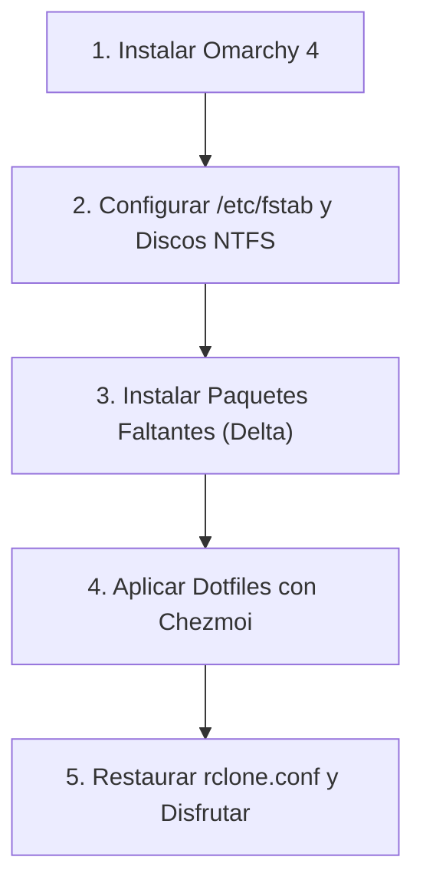

# 🚀 Omarchy 4 Dotfiles & Workstation Configuration

Repositorio integral de configuración, dotfiles y utilitarios para **Omarchy 4** (Arch Linux con Hyprland y arquitectura modular en Lua), gestionado con **[Chezmoi](https://www.chezmoi.io/)**.

---

## 🎙️ Stack de Voz e IA: Voxtype (Dictado ES & Traducción EN)

Omarchy y Hyprland integran un sistema Push-to-Talk de dictado por voz ultrarrápido con modelos Whisper locales:

* **Atajo `F9` (Dictado en Español):**
  * Invoca `voxtype record start` (al presionar) y `voxtype record stop` (al soltar).
  * Transcribe en español (`language = "es"`) utilizando el modelo local `small`.
  * Escribe el texto simulando pulsaciones de teclado directamente donde esté el cursor.
* **Atajo `F10` (Traducción en Tiempo Real ES $\rightarrow$ EN):**
  * Invoca `voxtype record start --profile translate`.
  * Graba tu voz en español, transcribe con Whisper y procesa la salida mediante el comando `trans -b -s es -t en` ([`translate-shell`](https://github.com/soimort/translate-shell)), escribiendo el resultado traducido al inglés.
* **Aislamiento de GPU (VRAM):**
  * Configurado en `config.toml` con `on_demand_loading = true` y `gpu_isolation = true`. El modelo se carga en la VRAM de la GPU **únicamente** mientras se mantenga presionada la tecla `F9` o `F10`, liberando la memoria al soltar.

> [!NOTE]
> **¿Dónde están los modelos y cómo se descargan?**
> Los archivos binarios de Whisper (`ggml-small.bin`, ~466 MB) no se suben a Git por su peso. En su lugar, el repositorio incluye un hook automático (`run_once_after_04_voxtype_model.sh`) que descarga y activa el modelo automáticamente al aplicar Chezmoi:
> ```bash
> voxtype setup --download --model small --activate
> ```

---

## 🧭 ¿Qué incluye Omarchy 4 de serie vs. Qué debes instalar?

### ✅ Ya incluido de fábrica en Omarchy 4 (NO necesitas instalarlo):
* **Herramientas de sistema y atajos:** `omacalc` (calculadora oficial), `cliamp` (reproductor de música en terminal), `btop`, `fd`, `ripgrep`, `bat`, `docker`, `docker-compose`, `python-gobject`, `mpv`, `imv`, `lazygit`, `fastfetch`, `mise-bin`.
* **Webapps base:** `Basecamp`, `HEY`, `Discord`, `Zoom`, `X`, `YouTube`, `WhatsApp`, `Google Maps`, `Google Messages`, `Google Photos`.

---

### 📥 El Delta que SÍ debes instalar (Lo que no viene en la ISO):

Todos los comandos son **100% idempotentes** gracias a la bandera `--needed`:

#### 1. Almacenamiento, FUSE y Discos NTFS
```bash
sudo pacman -S --needed rclone fuse3 ntfs-3g
```

#### 2. Dictado por Voz, Traducción Shell & AUR
```bash
sudo pacman -S --needed translate-shell
yay -S --needed voxtype-bin
```

#### 3. Ofimática y Tipografías MS
```bash
yay -S --needed onlyoffice-bin ttf-ms-fonts ttf-vista-fonts ttf-aptos-fonts
fc-cache -fv
```

---

## 🔄 Protocolo de Restauración desde Cero (Disaster Recovery)

Si reinstalas el sistema de cero:



### Paso 1: Sistema Base
Instalar Omarchy 4 desde la ISO oficial y reiniciar.

### Paso 2: Discos Físicos (/etc/fstab)
Configurar los montajes de discos NTFS en `/etc/fstab` (según `omarchy4-storage-workflow-runbook.md`):
```bash
sudo mkdir -p /mnt/DATOS-2TB /mnt/BACKUP-1TB /mnt/BACKUP-4TB
sudo mount -a
```

### Paso 3: Instalar únicamente el Delta
```bash
sudo pacman -S --needed rclone fuse3 ntfs-3g translate-shell
yay -S --needed voxtype-bin onlyoffice-bin ttf-ms-fonts ttf-vista-fonts ttf-aptos-fonts
fc-cache -fv
```

### Paso 4: Desplegar Dotfiles con Chezmoi
```bash
# 1. Instalar chezmoi (vía mise o pacman)
mise use -g chezmoi || sudo pacman -S chezmoi

# 2. Inicializar y aplicar todo tu entorno en 1 paso:
chezmoi init --apply https://github.com/lumusitech/dotfiles.git
```
*Los hooks automáticos de Chezmoi se encargarán de:*
* Sincronizar todos los runtimes (`Node`, `Java`, `Python`, etc.) con `mise install`.
* Descargar el modelo Whisper `small` para Voxtype de forma desatendida.
* Habilitar y levantar los servicios en `systemd --user` (`rclone-mount@` y `voxtype.service`).
* Aplicar optimizaciones de visualización en Nautilus.
* Desplegar todos los atajos de teclado, scripts de `~/.local/bin/`, webapps e iconos.

### Paso 5: Credenciales Cloud
Copiar tu archivo `rclone.conf` con las credenciales de Google Drive hacia `~/.config/rclone/rclone.conf` (puedes consultar la plantilla en `docs/rclone.conf.example`).

---

## 🛠️ Flujo Diario de Mantenimiento

| Tarea | Comando / Alias |
| :--- | :--- |
| **Ver cambios modificados en el sistema** | `czst` (`chezmoi status`) |
| **Revisar diferencias antes de sincronizar** | `czdiff` (`chezmoi diff`) |
| **Absorber cambios de tu $HOME hacia el repo** | `czre` (`chezmoi re-add`) |
| **Entrar al directorio del repo con la terminal** | `czcd` (`chezmoi cd`) |
| **Sincronizar cambios a GitHub en 1 paso** | `czsync` |
| **En otra PC: descargar cambios y aplicarlos** | `czup` (`chezmoi update`) |
