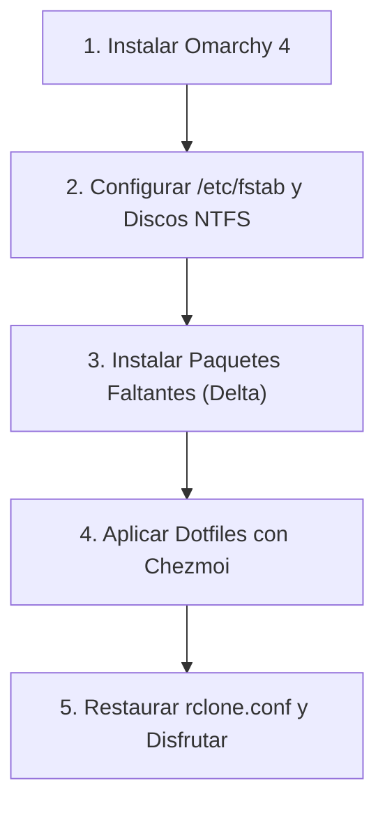
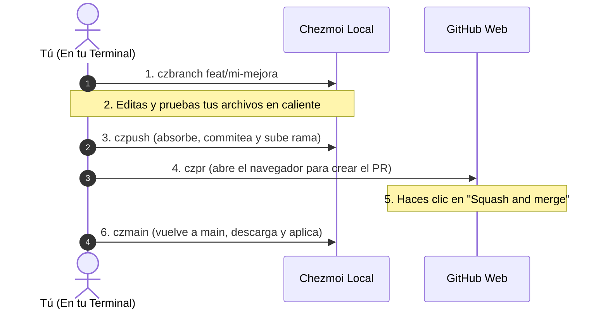

# 🚀 Omarchy 4 Dotfiles & Workstation Configuration

Repositorio integral de configuración, dotfiles y utilitarios para **Omarchy 4** (Arch Linux con Hyprland y arquitectura modular en Lua), gestionado con **[Chezmoi](https://www.chezmoi.io/)**.

---

## 🎙️ Stack de Voz e IA: Voxtype (Dictado ES & Traducción EN)

Omarchy y Hyprland integran un sistema Push-to-Talk de dictado por voz ultrarrápido con modelos Whisper locales:

* **Atajo `F9` (Dictado en Español):**
  * Invoca `voxtype record start` (al presionar) y `voxtype record stop` (al soltar).
  * Transcribe en español (`language = "es"`) utilizando el modelo local `small`.
  * Escribe el texto simulando pulsaciones de teclado directamente donde esté el cursor.
* **Atajo `F10` (Traducción en Tiempo Real ES $\rightarrow$ EN):**
  * Invoca `voxtype record start --profile translate`.
  * Graba tu voz en español, transcribe con Whisper y procesa la salida mediante el comando `trans -b -s es -t en` ([`translate-shell`](https://github.com/soimort/translate-shell)), escribiendo el resultado traducido al inglés.
* **Aislamiento dinámico de GPU (VRAM):**
  * Configurado en `config.toml` con `on_demand_loading = true` y `gpu_isolation = true`. El modelo se carga en la memoria de la tarjeta gráfica **únicamente** mientras se mantenga presionada la tecla `F9` o `F10`, liberando la memoria al soltar.

> [!NOTE]
> **Descarga automática de modelos:**
> Los archivos binarios de Whisper (`ggml-small.bin`, ~466 MB) no se suben a Git por su peso. El hook automático `run_once_after_04_voxtype_model.sh` lo descarga y activa automáticamente al aplicar Chezmoi por primera vez.

---

## 🧭 ¿Qué incluye Omarchy 4 de serie vs. Qué debes instalar?

### ✅ Ya incluido de fábrica en Omarchy 4 (NO necesitas instalarlo):
* **Herramientas de sistema y atajos:** `omacalc` (calculadora oficial), `cliamp` (reproductor de música en terminal), `btop`, `fd`, `ripgrep`, `bat`, `docker`, `docker-compose`, `python-gobject`, `mpv`, `imv`, `lazygit`, `fastfetch`, `mise-bin`.
* **Webapps base:** `Basecamp`, `HEY`, `Discord`, `Zoom`, `X`, `YouTube`, `WhatsApp`, `Google Maps`, `Google Messages`, `Google Photos`.

---

### 📥 El Delta que SÍ debes instalar (Lo que no viene en la ISO):

Todos los comandos son **100% idempotentes** gracias a la bandera `--needed`:

#### 1. Almacenamiento, FUSE y Discos NTFS
```bash
sudo pacman -S --needed rclone fuse3 ntfs-3g
```

#### 2. Dictado por Voz, Traducción Shell & AUR
```bash
sudo pacman -S --needed translate-shell
yay -S --needed voxtype-bin
```

#### 3. Ofimática, PDFs y Tipografías MS
```bash
sudo pacman -S --needed pdfarranger
yay -S --needed onlyoffice-bin ttf-ms-fonts ttf-vista-fonts ttf-aptos-fonts
fc-cache -fv
```

#### 4. Integración Móvil y Red Hotspot 5G
```bash
sudo pacman -S --needed kdeconnect breeze qqc2-breeze-style sshfs dnsmasq
yay -S --needed hypr-kdeconnect-fix-git
```

#### 5. Productividad en Terminal & Explorador de Archivos (TUI)
```bash
sudo pacman -S --needed superfile
```
* **Superfile (`spf`):** Explorador de archivos moderno para terminal con pestañas, paneles divididos, previsualización de sintaxis y soporte de imágenes.

---

## 🔄 Protocolo de Restauración desde Cero (Disaster Recovery)

Si reinstalas el sistema de cero:



### Paso 1: Sistema Base
Instalar Omarchy 4 desde la ISO oficial y reiniciar.

### Paso 2: Discos Físicos (/etc/fstab)
Configurar los montajes de discos NTFS en `/etc/fstab` (según `omarchy4-storage-workflow-runbook.md`):
```bash
sudo mkdir -p /mnt/DATOS-2TB /mnt/BACKUP-1TB /mnt/BACKUP-4TB
sudo mount -a
```

### Paso 3: Instalar únicamente el Delta y habilitar Docker
```bash
sudo pacman -S --needed rclone fuse3 ntfs-3g translate-shell kdeconnect breeze qqc2-breeze-style sshfs dnsmasq pdfarranger superfile
yay -S --needed voxtype-bin onlyoffice-bin ttf-ms-fonts ttf-vista-fonts ttf-aptos-fonts hypr-kdeconnect-fix-git
fc-cache -fv

# Habilitar servicio Docker e incorporar usuario al grupo (cerrar sesión y volver a entrar o 'newgrp docker')
sudo systemctl enable --now docker
sudo usermod -aG docker $USER

# Reglas de Firewall (UFW) para Hotspot y reenvío de Internet (wlo1 -> enp5s0)
sudo ufw allow in on wlo1
sudo ufw route allow in on wlo1 out on enp5s0

# Aprovisionar prevención de instant wake (suspensión profunda sólo con botón Power)
sudo cp docs/systemd/disable-wakeup-triggers.service /etc/systemd/system/
sudo systemctl daemon-reload
sudo systemctl enable disable-wakeup-triggers.service
```

### Paso 4: Desplegar Dotfiles con Chezmoi
```bash
# 1. Instalar chezmoi (vía mise o pacman)
mise use -g chezmoi || sudo pacman -S --needed chezmoi

# 2. Inicializar y aplicar todo tu entorno en 1 paso:
chezmoi init --apply https://github.com/lumusitech/dotfiles.git
```
*Los hooks automáticos de Chezmoi se encargarán de:*
* Sincronizar runtimes (`Node`, `Java`, `Python`, etc.) con `mise install`.
* Descargar el modelo Whisper `small` de Voxtype de forma desatendida.
* Aprovisionar y sincronizar la suite de plugins de Omarchy Shell (`quickshell-screentime`, `omaland`, `nexthop`, `omaconnect`, `omamail`), inyectar accesos de menú y refrescar la barra.
* Habilitar y arrancar servicios de usuario (`rclone-mount@`, `onedrive-mount@`, `voxtype.service` y `notify-video-editor.service`).
* Aplicar optimizaciones de visualización en Nautilus.
* Desplegar todos los atajos de teclado, scripts de `~/.local/bin/`, webapps e iconos.

### Paso 5: Credenciales Cloud
Copiar tu archivo `rclone.conf` con las credenciales de Google Drive y OneDrive hacia `~/.config/rclone/rclone.conf` (plantilla de referencia en `docs/rclone.conf.example`).

---

## 🪟 Virtualización: Windows 11 VM en Omarchy 4

Omarchy 4 integra virtualización KVM asistida por Docker (`dockurr/windows`) con acceso por FreeRDP (`xfreerdp3`), escalado HiDPI dinámico en Hyprland y ciclo de vida automatizado vía el script [`launch-windows-vm`](dot_local/bin/executable_launch-windows-vm).

* **Arranque y sondeo activo:** Espera automáticamente la disponibilidad del protocolo RDP (X.224) antes de conectar.
* **Seguridad y compatibilidad:** Forzado de `/sec:tls /cert:ignore` para compatibilidad con la configuración de `dockurr/windows` (`UserAuthentication=0`).
* **Diagnósticos integrados:** Registro persistente en `~/.local/state/windows-vm-rdp.log`.
* **Modo persistente:** Admite `--keep-alive` (`-k`) para mantener la VM encendida al cerrar la ventana de FreeRDP.

📖 Documentación técnica completa y runbook: [`docs/windows-vm.md`](docs/windows-vm.md).

---

## 📱 Integración Móvil y Hotspot 5 GHz

Omarchy 4 integra una suite de sincronización y conectividad optimizada para tablets y smartphones (Samsung Galaxy Tab / Android):

* **KDE Connect sobre Hyprland:** Servicio en segundo plano silencioso (`/usr/bin/kdeconnectd`) sin íconos obsoletos en la bandeja, widget interactivo en la barra superior (**OmaConnect**) con desplegable flotante de estado en tiempo real (batería, red celular, señal, acciones rápidas y multimedia con atajo **`Super + Shift + C`** o clic), y acceso complementario a la interfaz completa Kirigami/Qt6 mediante scratchpad flotante centrado con **`Super + Shift + K`**. Integración nativa de tema oscuro (`dot_config/kdeglobals`), soporte de mouse/teclado y S-Pen en Wayland vía `hypr-kdeconnect-fix-git` (`libei`), y navegación directa de archivos en Nautilus.
* **Hotspot Wi-Fi Dedicado 5 GHz (`PC-5G`):** Punto de acceso en canal 36 (5180 MHz) vía `wlo1` con DHCP (`dnsmasq`) y reenvío de tráfico internet a través de Ethernet Gigabit (`enp5s0`), eliminando por completo el jitter y los microcortes de audio causados por el *Band Steering* del router hogareño.
* **Scripts de control rápido:** Utilitarios [`hotspot-on`](dot_local/bin/executable_hotspot-on), [`hotspot-off`](dot_local/bin/executable_hotspot-off) y [`hotspot`](dot_local/bin/executable_hotspot) en `~/.local/bin/`.
* **Streaming Sunshine:** Desactivado y removido debido a rendimiento deficiente.

📖 Documentación técnica completa, diagnóstico de hardware y runbook: [`docs/mobile-and-remote-streaming.md`](docs/mobile-and-remote-streaming.md).

---

## 🧩 Ecosistema de Plugins y Barra en Omarchy 4 (Omarchy Shell & Hyprland)

Omarchy 4 desacopla la gestión del entorno en dos capas:
1. **`omarchy-shell` (Quickshell):** Un runtime único y persistente que aloja la barra de estado (`omarchy.bar`), notificaciones, menús (`omarchy.menu`), overlays y paneles modales. Se configura de forma reactiva en `~/.config/omarchy/shell.json` y se extiende con plugins en `~/.config/omarchy/plugins/<id>/`.
2. **Hyprland configurado en Lua:** La arquitectura de ventanas y atajos se define en `~/.config/hypr/` (`hyprland.lua`, `bindings.lua`, `looknfeel.lua`, etc.) usando las tablas globales `o` y `hl`.

### 1. Tipos de Plugins en Omarchy Shell (`manifest.json`)
* **`bar-widget`:** Componentes con representación visual en la barra de estado (`left`, `center`, `right`). Se insertan directamente en `bar.layout` de `shell.json`.
* **`panel` / `overlay` / `service`:** Ventanas emergentes flotantes (HUDs, inspectores gráficos) o procesos en segundo plano. Se declaran en el arreglo `"plugins": [{"id": "..."}]` de `shell.json` y se invocan bajo demanda (atajo de teclado o menú).

### 2. Comandos Nativos de Orquestación
```bash
# 1. Ver plugins descubiertos (first-party y third-party) con su estado y tipos
omarchy plugin list

# 2. Instalar un plugin desde GitHub
omarchy plugin add https://github.com/autor/repo.git

# 3. Ubicar un widget en una sección específica de la barra sin desordenar los existentes
omarchy bar put <plugin-id> --section right --before omarchy.network

# 4. Reubicar un widget por sección e índice
omarchy bar move <plugin-id> --section right --index 2

# 5. Clonar un widget nativo para modificar su código QML con seguridad
omarchy plugin clone omarchy.workspaces
# Crea ~/.config/omarchy/plugins/<usuario>.workspaces/ con recarga automática en caliente
```

### 3. Asignación de Atajos de Teclado en Hyprland (Lua)
Los paneles y overlays que no viven fijos en la barra se disparan mediante IPC hacia `omarchy-shell`. Se configuran en `~/.config/hypr/bindings.lua`:
```lua
-- Lanzar o alternar el inspector visual de Hyprland (Omaland)
o.bind("SUPER + SHIFT + O", "Omaland Look & Feel", "omarchy-shell shell toggle bobbynicholas.omaland")

-- Invocar panel rápido de correos no leídos
o.bind("SUPER + ALT + M", "Mail Glance", "omarchy-shell shell summon omamail")
```

### 4. Sandbox de Seguridad de Omarchy 4 y Resolución de Lanzadores (.desktop)
Por diseño de seguridad, Omarchy Shell (`publicPluginManifest`) elimina la propiedad `__sourceDir` de los manifiestos de plugins de terceros. Plugins como **Omaland** que intentan autoinstalar su `.desktop` en tiempo de ejecución fallan silenciosamente si dependen de esa ruta.

Para garantizar que aparezcan siempre en el buscador de aplicaciones (`Super + Space` / `Super + Alt + Space`) y en el menú contextual de Omarchy:
1. **Lanzador de escritorio:** Se plantilla en `~/.local/share/applications/omaland.desktop` con `Exec=omarchy-shell shell toggle bobbynicholas.omaland`.
2. **Integración en el menú:** Se añade a `~/.config/omarchy/extensions/omarchy-menu.jsonc`:
   ```jsonc
   "style.hyprland": {"icon":"","label":"Hyprland","aliases":["hyprland","looknfeel"]},
   "style.hyprland.omaland": {"icon":"󰸌","label":"Visual Editor (Omaland)","aliases":["omaland","visual"],"action":"omarchy-shell shell toggle bobbynicholas.omaland"}
   ```
3. **Hook de aprovisionamiento Chezmoi:** El script `run_onchange_after_05_omarchy_plugins.sh.tmpl` clona automáticamente todos los plugins comunitarios, aplica el parche de resiliencia en `Service.qml` y refresca la base de datos de aplicaciones en cualquier máquina nueva.

### 5. Suite Comunitaria Activa en este Entorno
| Plugin | ID / Repositorio | Tipo | Función |
| :--- | :--- | :--- | :--- |
| **Omaland** | `bobbynicholas.omaland` | `panel`, `service` | GUI en vivo para gaps, bordes, desenfoque y animaciones en Hyprland. |
| **OmaConnect** | `omaconnect` | `service`, `bar-widget` | Integración nativa de KDE Connect en la barra con desplegable de estado (batería, señal, ping, compartir y controles multimedia). |
| **Omamail** | `omamail` | `service`, `bar-widget`, `panel` | Notificador discreto de correo (Gmail, HEY, IMAP). |
| **Nexthop** | `io.github.x3me.nexthop` | `bar-widget`, `service` | Monitor de red que desglosa latencia de Wi-Fi local vs. ISP. |
| **Screen Time** | `agx.screen-time` | `service`, `bar-widget` | Rastreo pasivo del tiempo productivo por aplicación. |

---

## 📝 Scratchpad de Notas Rápidas (`Super + N`) y Markdown Enriquecido

Omarchy 4 integra una ventana flotante de notas rápidas (`notes.md`) gestionada como scratchpad en Hyprland (`special:notes`, flotante 1000x650):

* **Terminal dedicada Kitty:** El script [`toggle-notes`](dot_local/bin/executable_toggle-notes) invoca Neovim dentro de **Kitty** (`kitty --title=QuickNotes nvim $HOME/notes.md`), alineándose con el emulador por defecto del sistema y permitiendo renderizado nativo de imágenes vía *Kitty Graphics Protocol*.
* **Renderizado estético en Neovim ([`markdown.lua`](dot_config/nvim/lua/plugins/markdown.lua)):**
  * **Títulos y encabezados:** Iconos Nerd Font por nivel (`󰲡 `, `󰲣 `, `󰲥 `, etc.), fondo destacado en todo el ancho y supresión visual limpia de `#`.
  * **Bloques de código:** Cajas con bordes finos Unicode (`border = "thin"`), icono de lenguaje ( Lua,  Bash, 󰌷 Python, etc.) y nombre de lenguaje destacado.
  * **Tablas Unicode:** Bordes redondeados elegantes (`preset = "round"`: `╭─┬─╮`, `│ │ │`, `├─┼─┤`, `╰─┴─╯`) y cabeceras estilizadas.
  * **Casillas de verificación (To-Dos):** Íconos interactivos para tareas pendientes (`󰄱`), completadas (`󰄲`) y en progreso (`󰥔`).
  * **Imágenes inline y portapapeles:**
    * Imágenes renderizadas automáticamente en el buffer mediante [`snacks.nvim`](https://github.com/folke/snacks.nvim) (`snacks.image`).
    * Pegado instantáneo de capturas de pantalla desde el portapapeles con `<leader>p` vía [`img-clip.nvim`](https://github.com/HakonHarnes/img-clip.nvim).
  * **Edición interactiva:** Navegación por tablas y alternancia to-do con [`mkdnflow.nvim`](https://github.com/jakewvincent/mkdnflow.nvim).
  * **Vista previa web sincrónica:** Atajo `<leader>cp` para abrir previsualización en el navegador en tiempo real ([`markdown-preview.nvim`](https://github.com/iamcco/markdown-preview.nvim)).

---

## 🛡️ Guía Paso a Paso: Cómo Modificar y Guardar tus Dotfiles

La rama principal **`main` está protegida en GitHub**. Nadie puede hacer push directo para evitar romper configuraciones en producción.

Cualquier cambio se realiza a través de **Ramas Auxiliares + Pull Requests + Squash and Merge**:



### El Paso a Paso Detallado:

#### Paso 1: Crear una rama de trabajo auxiliar
Antes de empezar a hacer modificaciones, crea una rama temporal desde tu terminal:
```bash
czbranch feat/nombre-del-cambio
```
*(Ejemplo: `czbranch feat/nuevo-atajo-calculadora` o `czbranch fix/ajuste-fuentes`)*.

#### Paso 2: Editar y probar normalmente en tu sistema
Edita tus archivos donde siempre lo haces:
* Si es un atajo de Hyprland $\rightarrow$ editas `~/.config/hypr/bindings.lua`.
* Si es un script $\rightarrow$ editas `~/.local/bin/mi-script`.
* Si es un alias $\rightarrow$ editas `~/.bash_aliases`.
* Pruebas que funcione y que no tenga errores.

*(Opcional: puedes correr `czdiff` en cualquier momento para ver exactamente qué líneas cambiaste).*

#### Paso 3: Guardar y subir a GitHub con `czpush`
Cuando estés conforme con tu cambio, ejecuta:
```bash
czpush
```
*Este comando automáticamente:*
1. Verifica que no estés en `main` (para protegerte de rechazos).
2. Absorbe tus cambios de `$HOME` con `chezmoi re-add`.
3. Prepara los archivos (`git add .`).
4. Abre tu editor para que escribas un mensaje de commit descriptivo.
5. Sube la rama auxiliar a GitHub (`git push -u origin <rama>`).

#### Paso 4: Crear el Pull Request con `czpr`
Ejecuta:
```bash
czpr
```
Se abrirá automáticamente la página de GitHub con el formulario de Pull Request listo. Solo revisas el título y haces clic en **"Create pull request"**.

#### Paso 5: En GitHub Web: "Squash and merge"
1. En la página del Pull Request en GitHub, ve al botón verde al final de la página.
2. Asegúrate de que diga **"Squash and merge"** (comprime todos tus commits en uno solo limpio).
3. Haz clic en **Confirm squash and merge**.
*(GitHub eliminará automáticamente la rama auxiliar para mantener el repo limpio).*

#### Paso 6: Volver a sincronizar tu máquina con `czmain`
Vuelve a tu terminal y ejecuta:
```bash
czmain
```
*Este comando:*
1. Te regresa a la rama `main` local.
2. Descarga el commit limpio recién mergeado y poda referencias (`git pull --prune`).
3. **Elimina automáticamente la rama auxiliar local** en la que estabas y barre cualquier otra rama huérfana vieja (`[gone]`).
4. Aplica los cambios en tu sistema (`chezmoi apply`).

---

## 🧰 Cheat Sheet de Comandos Rápidos

| Comando | Para qué sirve |
| :--- | :--- |
| **`czst`** | Ver qué archivos has modificado en tu `$HOME` y aún no guardaste en Chezmoi (`chezmoi status`). |
| **`czdiff`** | Ver las diferencias línea por línea de lo que cambiaste (`chezmoi diff`). |
| **`czbranch <nombre>`** | Crear y cambiar a una rama de trabajo auxiliar en Chezmoi. |
| **`czpush`** | Absorber cambios, commitear y subir la rama a GitHub. |
| **`czpr`** | Abrir la web de GitHub para crear el Pull Request. |
| **`czmain`** | Cambiar a `main`, descargar lo mergeado, auto-eliminar ramas del PR y aplicar dotfiles. |
| **`czcd`** | Abrir una sub-terminal directamente dentro del repositorio Chezmoi. |
| **`czup`** | En otra computadora: descargar lo último de GitHub y aplicarlo de inmediato. |
| **`hotspot`** | Alternar encendido/apagado del Hotspot Wi-Fi 5 GHz (`PC-5G`). |
| **`hotspot-on`** | Activar Hotspot Wi-Fi 5 GHz dedicado para streaming de pantalla. |
| **`hotspot-off`** | Desactivar Hotspot 5 GHz y devolver dispositivos al Wi-Fi del hogar. |
| **`Super + N`** | Alternar scratchpad de Notas Rápidas en Kitty con Markdown enriquecido. |
| **`Super + M`** | Alternar scratchpad de YouTube Music Web App. |
| **`Super + W`** | Alternar scratchpad de WhatsApp Web. |
| **`Super + Q`** | Cerrar la ventana activa (reemplaza el atajo original Super + W). |
| **`<leader>p`** | (En Neovim) Pegar imagen desde el portapapeles en archivos Markdown (`img-clip`). |
| **`<leader>cp`** | (En Neovim) Abrir previsualización web sincrónica en el navegador (`markdown-preview`). |

> [!TIP]
> **¿No te reconoce algún comando o alias?**
> Recuerda recargar tu sesión con:
> ```bash
> source ~/.bash_aliases
> ```
