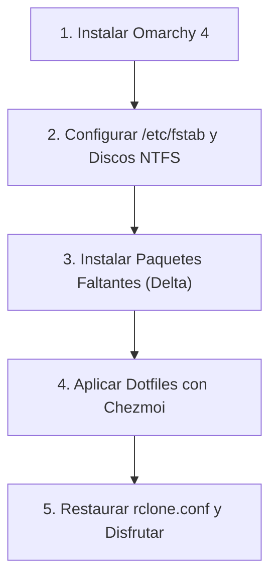
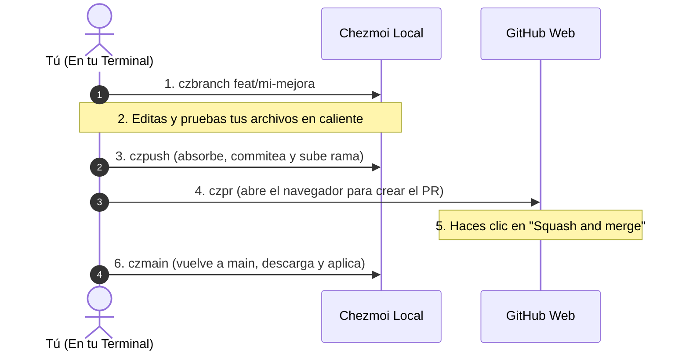

# 🚀 Omarchy 4 Dotfiles & Workstation Configuration

Repositorio integral de configuración, dotfiles y utilitarios para **Omarchy 4** (Arch Linux con Hyprland y arquitectura modular en Lua), gestionado con **[Chezmoi](https://www.chezmoi.io/)**.

---

## 🎙️ Stack de Voz e IA: Voxtype (Dictado ES & Traducción EN)

Omarchy y Hyprland integran un sistema Push-to-Talk de dictado por voz ultrarrápido con modelos Whisper locales:

* **Atajo `F9` (Dictado en Español):**
  * Invoca `voxtype record start` (al presionar) y `voxtype record stop` (al soltar).
  * Transcribe en español (`language = "es"`) utilizando el modelo local `small`.
  * Escribe el texto simulando pulsaciones de teclado directamente donde esté el cursor.
* **Atajo `F10` (Traducción en Tiempo Real ES $\rightarrow$ EN):**
  * Invoca `voxtype record start --profile translate`.
  * Graba tu voz en español, transcribe con Whisper y procesa la salida mediante el comando `trans -b -s es -t en` ([`translate-shell`](https://github.com/soimort/translate-shell)), escribiendo el resultado traducido al inglés.
* **Aislamiento dinámico de GPU (VRAM):**
  * Configurado en `config.toml` con `on_demand_loading = true` y `gpu_isolation = true`. El modelo se carga en la memoria de la tarjeta gráfica **únicamente** mientras se mantenga presionada la tecla `F9` o `F10`, liberando la memoria al soltar.

> [!NOTE]
> **Descarga automática de modelos:**
> Los archivos binarios de Whisper (`ggml-small.bin`, ~466 MB) no se suben a Git por su peso. El hook automático `run_once_after_04_voxtype_model.sh` lo descarga y activa automáticamente al aplicar Chezmoi por primera vez.

---

## 🧭 ¿Qué incluye Omarchy 4 de serie vs. Qué debes instalar?

### ✅ Ya incluido de fábrica en Omarchy 4 (NO necesitas instalarlo):
* **Herramientas de sistema y atajos:** `omacalc` (calculadora oficial), `cliamp` (reproductor de música en terminal), `btop`, `fd`, `ripgrep`, `bat`, `docker`, `docker-compose`, `python-gobject`, `mpv`, `imv`, `lazygit`, `fastfetch`, `mise-bin`.
* **Webapps base:** `Basecamp`, `HEY`, `Discord`, `Zoom`, `X`, `YouTube`, `WhatsApp`, `Google Maps`, `Google Messages`, `Google Photos`.

---

### 📥 El Delta que SÍ debes instalar (Lo que no viene en la ISO):

Todos los comandos son **100% idempotentes** gracias a la bandera `--needed`:

#### 1. Almacenamiento, FUSE y Discos NTFS
```bash
sudo pacman -S --needed rclone fuse3 ntfs-3g
```

#### 2. Dictado por Voz, Traducción Shell & AUR
```bash
sudo pacman -S --needed translate-shell
yay -S --needed voxtype-bin
```

#### 3. Ofimática y Tipografías MS
```bash
yay -S --needed onlyoffice-bin ttf-ms-fonts ttf-vista-fonts ttf-aptos-fonts
fc-cache -fv
```

---

## 🔄 Protocolo de Restauración desde Cero (Disaster Recovery)

Si reinstalas el sistema de cero:



### Paso 1: Sistema Base
Instalar Omarchy 4 desde la ISO oficial y reiniciar.

### Paso 2: Discos Físicos (/etc/fstab)
Configurar los montajes de discos NTFS en `/etc/fstab` (según `omarchy4-storage-workflow-runbook.md`):
```bash
sudo mkdir -p /mnt/DATOS-2TB /mnt/BACKUP-1TB /mnt/BACKUP-4TB
sudo mount -a
```

### Paso 3: Instalar únicamente el Delta
```bash
sudo pacman -S --needed rclone fuse3 ntfs-3g translate-shell
yay -S --needed voxtype-bin onlyoffice-bin ttf-ms-fonts ttf-vista-fonts ttf-aptos-fonts
fc-cache -fv
```

### Paso 4: Desplegar Dotfiles con Chezmoi
```bash
# 1. Instalar chezmoi (vía mise o pacman)
mise use -g chezmoi || sudo pacman -S chezmoi

# 2. Inicializar y aplicar todo tu entorno en 1 paso:
chezmoi init --apply https://github.com/lumusitech/dotfiles.git
```
*Los hooks automáticos de Chezmoi se encargarán de:*
* Sincronizar runtimes (`Node`, `Java`, `Python`, etc.) con `mise install`.
* Descargar el modelo Whisper `small` de Voxtype de forma desatendida.
* Habilitar y arrancar servicios de usuario (`rclone-mount@`, `onedrive-mount@`, `voxtype.service` y `notify-video-editor.service`).
* Aplicar optimizaciones de visualización en Nautilus.
* Desplegar todos los atajos de teclado, scripts de `~/.local/bin/`, webapps e iconos.

### Paso 5: Credenciales Cloud
Copiar tu archivo `rclone.conf` con las credenciales de Google Drive y OneDrive hacia `~/.config/rclone/rclone.conf` (plantilla de referencia en `docs/rclone.conf.example`).

---

## 🛡️ Guía Paso a Paso: Cómo Modificar y Guardar tus Dotfiles

La rama principal **`main` está protegida en GitHub**. Nadie puede hacer push directo para evitar romper configuraciones en producción.

Cualquier cambio se realiza a través de **Ramas Auxiliares + Pull Requests + Squash and Merge**:



### El Paso a Paso Detallado:

#### Paso 1: Crear una rama de trabajo auxiliar
Antes de empezar a hacer modificaciones, crea una rama temporal desde tu terminal:
```bash
czbranch feat/nombre-del-cambio
```
*(Ejemplo: `czbranch feat/nuevo-atajo-calculadora` o `czbranch fix/ajuste-fuentes`)*.

#### Paso 2: Editar y probar normalmente en tu sistema
Edita tus archivos donde siempre lo haces:
* Si es un atajo de Hyprland $\rightarrow$ editas `~/.config/hypr/bindings.lua`.
* Si es un script $\rightarrow$ editas `~/.local/bin/mi-script`.
* Si es un alias $\rightarrow$ editas `~/.bash_aliases`.
* Pruebas que funcione y que no tenga errores.

*(Opcional: puedes correr `czdiff` en cualquier momento para ver exactamente qué líneas cambiaste).*

#### Paso 3: Guardar y subir a GitHub con `czpush`
Cuando estés conforme con tu cambio, ejecuta:
```bash
czpush
```
*Este comando automáticamente:*
1. Verifica que no estés en `main` (para protegerte de rechazos).
2. Absorbe tus cambios de `$HOME` con `chezmoi re-add`.
3. Prepara los archivos (`git add .`).
4. Abre tu editor para que escribas un mensaje de commit descriptivo.
5. Sube la rama auxiliar a GitHub (`git push -u origin <rama>`).

#### Paso 4: Crear el Pull Request con `czpr`
Ejecuta:
```bash
czpr
```
Se abrirá automáticamente la página de GitHub con el formulario de Pull Request listo. Solo revisas el título y haces clic en **"Create pull request"**.

#### Paso 5: En GitHub Web: "Squash and merge"
1. En la página del Pull Request en GitHub, ve al botón verde al final de la página.
2. Asegúrate de que diga **"Squash and merge"** (comprime todos tus commits en uno solo limpio).
3. Haz clic en **Confirm squash and merge**.
*(GitHub eliminará automáticamente la rama auxiliar para mantener el repo limpio).*

#### Paso 6: Volver a sincronizar tu máquina con `czmain`
Vuelve a tu terminal y ejecuta:
```bash
czmain
```
*Este comando:*
1. Te regresa a la rama `main` local.
2. Descarga el commit limpio recién mergeado (`git pull`).
3. Aplica los cambios en tu sistema (`chezmoi apply`).

---

## 🧰 Cheat Sheet de Comandos Rápidos

| Comando | Para qué sirve |
| :--- | :--- |
| **`czst`** | Ver qué archivos has modificado en tu `$HOME` y aún no guardaste en Chezmoi (`chezmoi status`). |
| **`czdiff`** | Ver las diferencias línea por línea de lo que cambiaste (`chezmoi diff`). |
| **`czbranch <nombre>`** | Crear y cambiar a una rama de trabajo auxiliar en Chezmoi. |
| **`czpush`** | Absorber cambios, commitear y subir la rama a GitHub. |
| **`czpr`** | Abrir la web de GitHub para crear el Pull Request. |
| **`czmain`** | Cambiar a `main`, descargar lo mergeado y aplicar a tu sistema. |
| **`czcd`** | Abrir una sub-terminal directamente dentro del repositorio Chezmoi. |
| **`czup`** | En otra computadora: descargar lo último de GitHub y aplicarlo de inmediato. |

> [!TIP]
> **¿No te reconoce algún comando o alias?**
> Recuerda recargar tu sesión con:
> ```bash
> source ~/.bash_aliases
> ```
