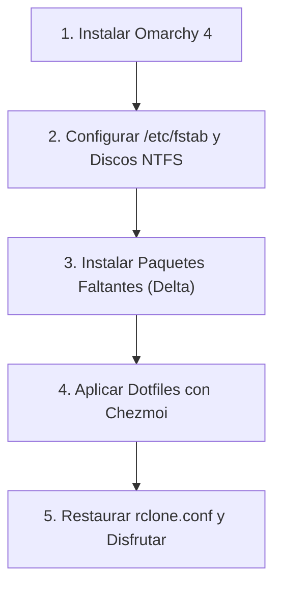

# 🚀 Omarchy 4 Dotfiles & Workstation Configuration

Repositorio integral de configuración, dotfiles y utilitarios para **Omarchy 4** (Arch Linux con Hyprland y arquitectura modular en Lua), gestionado con **[Chezmoi](https://www.chezmoi.io/)**.

---

## 🧭 ¿Qué incluye Omarchy 4 de serie vs. Qué debes instalar?

Omarchy 4 ya viene con un stack muy completo preinstalado en su ISO base (`/usr/share/omarchy/`). Para evitar instalaciones redundantes, esta es la separación exacta:

### ✅ Ya incluido de fábrica en Omarchy 4 (NO necesitas instalarlo):
* **Herramientas de sistema y atajos:** `omacalc` (calculadora oficial), `cliamp` (reproductor de música en terminal), `btop`, `fd`, `ripgrep`, `bat`, `docker`, `docker-compose`, `python-gobject`, `mpv`, `imv`, `lazygit`, `fastfetch`, `mise-bin`.
* **Webapps base:** `Basecamp`, `HEY`, `Discord`, `Zoom`, `X`, `YouTube`, `WhatsApp`, `Google Maps`, `Google Messages`, `Google Photos`.

---

### 📥 El Delta que SÍ debes instalar (Lo que no viene en la ISO):

Todos los comandos utilizan el flag `--needed`, por lo que son **100% idempotentes** (si un paquete ya existe, pacman/yay lo omite automáticamente sin reinstalarlo ni reejecutar hooks):

#### 1. Almacenamiento, FUSE y Discos NTFS
```bash
sudo pacman -S --needed rclone fuse3 ntfs-3g
```

#### 2. Atajos Especiales & Dictado
* `voxtype-bin` es requerido para los atajos `F9` (dictado en español) y `F10` (traducción en tiempo real a inglés) definidos en `bindings.lua`:
```bash
yay -S --needed voxtype-bin
```

#### 3. Ofimática y Tipografías MS
```bash
yay -S --needed onlyoffice-bin ttf-ms-fonts ttf-vista-fonts ttf-aptos-fonts
fc-cache -fv
```

---

## 🌐 Webapps Personalizadas Integradas

Las webapps predeterminadas de Omarchy vienen en `/usr/share/omarchy/applications/`. En este repositorio de Chezmoi se respaldan **exclusivamente tus lanzadores y extensiones personalizadas** junto con sus iconos en `~/.local/share/icons/hicolor/256x256/apps/`:

* **Google Workspace Personal & Corporativo:**
  * Google Gemini (`SUPER + SHIFT + A`), Gemini NotebookLM
  * Google Gmail, Google Calendar, Google Keep, Google Tasks, Google Contacts
  * Google Drive (Personal) y Google Drive ABC
  * Google Meet, Google Translate, Google Sheets (con handler `open-google-sheet`), Google Vids, Google Books
* **Streaming & Educación:**
  * YouTube Music (`SUPER + M`)
  * DevTalles, Udemy, GitHub, Microsoft OneDrive

---

## 🔄 Protocolo de Restauración desde Cero (Disaster Recovery)

Si reinstalas el sistema de cero:



### Paso 1: Sistema Base
Instalar Omarchy 4 desde la ISO oficial y reiniciar.

### Paso 2: Discos Físicos (/etc/fstab)
Configurar los montajes de discos NTFS en `/etc/fstab` (según `omarchy4-storage-workflow-runbook.md`):
```bash
sudo mkdir -p /mnt/DATOS-2TB /mnt/BACKUP-1TB /mnt/BACKUP-4TB
sudo mount -a
```

### Paso 3: Instalar únicamente el Delta
```bash
sudo pacman -S --needed rclone fuse3 ntfs-3g
yay -S --needed voxtype-bin onlyoffice-bin ttf-ms-fonts ttf-vista-fonts ttf-aptos-fonts
fc-cache -fv
```

### Paso 4: Desplegar Dotfiles con Chezmoi
```bash
# 1. Instalar chezmoi (vía mise o pacman)
mise use -g chezmoi || sudo pacman -S chezmoi

# 2. Inicializar y aplicar todo tu entorno:
chezmoi init --apply https://github.com/lumusitech/dotfiles.git
```
*Los hooks automáticos de Chezmoi se encargarán de:*
* Sincronizar todos los runtimes (`Node`, `Java`, `Python`, etc.) con `mise install`.
* Habilitar y levantar los 4 servicios de `rclone-mount@` en `systemd --user`.
* Aplicar optimizaciones de visualización rápida en Nautilus.
* Desplegar todos los atajos de teclado, scripts de `~/.local/bin/`, webapps e iconos.

### Paso 5: Credenciales Cloud
Copiar tu archivo `rclone.conf` con las credenciales de Google Drive hacia `~/.config/rclone/rclone.conf` (puedes consultar la plantilla en `docs/rclone.conf.example`).

---

## 🛠️ Flujo Diario de Mantenimiento

| Tarea | Comando / Alias |
| :--- | :--- |
| **Ver cambios modificados en el sistema** | `czst` (`chezmoi status`) |
| **Revisar diferencias antes de sincronizar** | `czdiff` (`chezmoi diff`) |
| **Absorber cambios de tu $HOME hacia el repo** | `czre` (`chezmoi re-add`) |
| **Entrar al directorio del repo con la terminal** | `czcd` (`chezmoi cd`) |
| **Sincronizar cambios a GitHub en 1 paso** | `czsync` |
| **En otra PC: descargar cambios y aplicarlos** | `czup` (`chezmoi update`) |
