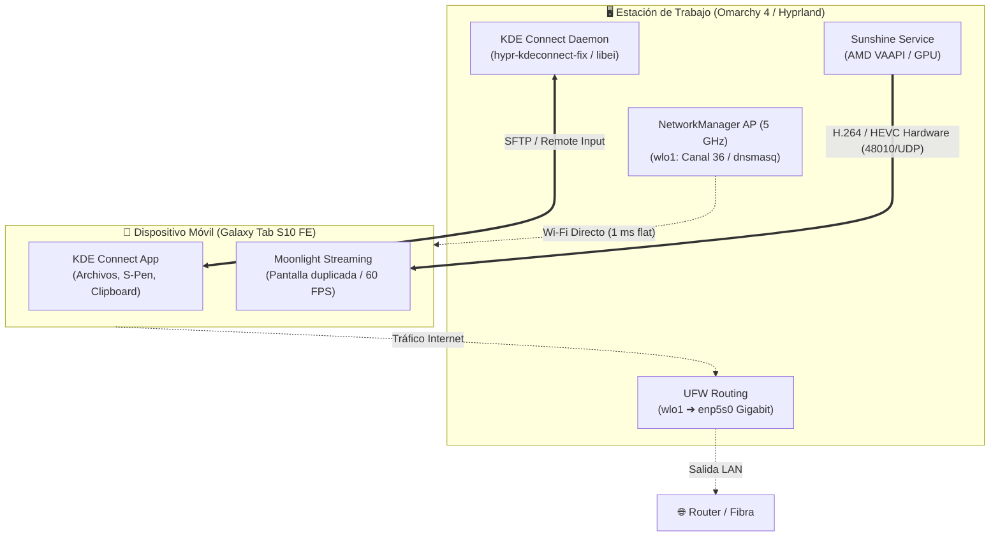

# 📱 Integración Móvil, Streaming y Red Dedicada (KDE Connect, Sunshine/Moonlight y Hotspot 5 GHz)

Guía completa de arquitectura, configuración, solución de problemas y utilitarios para la integración de dispositivos móviles (Samsung Galaxy Tab S10 FE) con **Omarchy 4** (Arch Linux / Hyprland).

---

## 🏛️ Visión General del Ecosistema

La estación de trabajo se encuentra optimizada para sincronización, control periférico y streaming de ultra baja latencia con dispositivos móviles:



---

## 🔌 1. Recuperación de Hardware: Wi-Fi & Bluetooth (Gigabyte B550M DS3H AC)

### ⚠️ Diagnóstico del Problema
Tras la migración desde un entorno previo con arranque dual o instalación de Windows 11, la tarjeta inalámbrica integrada PCIe Realtek RTL8821CE (`rtw88_8821ce`) y el módulo Bluetooth USB interno (`IMC Networks`, VID:PID `13d3:3529`) desaparecieron por completo del sistema:
* No figuraban en `lspci`, `lsusb`, `dmesg` ni `rfkill`.
* Módulos de kernel cargados manualmente (`modprobe rtw88_8821ce`, `modprobe btusb`) no encontraban ningún dispositivo que inicializar.

### 🔍 Causa Raíz: D3cold ACPI State Latch
El mecanismo *Fast Startup* o los controladores de Windows colocan los controladores PCIe/USB inalámbricos en estado de ultra bajo consumo **D3cold** antes del reinicio. En placas madre como la Gigabyte B550M DS3H AC, la energía auxiliar standby (+5VSB) mantiene retenida la lógica del controlador en ese estado "latched", cortando el reloj de referencia PCIe e impidiendo que el firmware UEFI o el kernel de Linux reconozcan el dispositivo en un arranque en caliente (*warm reboot*).

### 🛠️ Solución Definitiva: Drenaje de Condensadores (Cold Reset)
1. Apagar el equipo completamente (`systemctl poweroff`).
2. **Desconectar físicamente el cable de 220V de la fuente de poder (PSU)**.
3. Presionar repetidamente o mantener presionado el botón de encendido del gabinete durante **45 a 60 segundos**. Esto drena la energía residual almacenada en los capacitores de la placa madre y la fuente.
4. Reconectar el cable de alimentación y encender el equipo.
5. El hardware se reinicializa y reaparece de inmediato en el bus PCIe (`04:00.0 Network controller: Realtek Semiconductor Co., Ltd. RTL8821CE`) y USB (`IMC Networks Bluetooth Radio`).

---

## 🤝 2. Integración KDE Connect en Hyprland

KDE Connect permite compartir portapapeles, recibir notificaciones, enviar archivos, controlar multimedia y usar la tablet con el S-Pen como tableta gráfica o puntero.

### 📦 Paquetes Requeridos
```bash
sudo pacman -S --needed kdeconnect breeze qqc2-breeze-style sshfs
yay -S --needed hypr-kdeconnect-fix-git
```

### ⚙️ Inicio Automático
Se registra en [`dot_config/hypr/autostart.lua`](../dot_config/hypr/autostart.lua):
```lua
o.launch_on_start("kdeconnect-indicator")
```

### 🎨 Solución al Tema Claro Cegador (Kirigami / Qt6 Theming)
Al ejecutarse en un entorno Wayland puro sin KDE Plasma, las aplicaciones basadas en Kirigami/Qt (como `kdeconnect-app` y `kdeconnect-settings`) renderizaban fondos blancos con texto ilegible.

**Solución aplicada:** Aprovisionamiento de [`dot_config/kdeglobals`](../dot_config/kdeglobals) con la paleta de colores completa de `BreezeDark`, tema de iconos `breeze-dark` y estilo de widgets `Breeze`.

### 🖱️ Control Remoto en Wayland (Mouse, Teclado y S-Pen)
* **Problema:** En Wayland no existe `XTest`. Los módulos de entrada remota tradicionales de KDE Connect fallan silenciosamente.
* **Solución:** `hypr-kdeconnect-fix-git` corre en segundo plano como daemon emulando la interfaz DBus `org.freedesktop.portal.RemoteDesktop` y canalizando los eventos de mouse, teclado y clics a través del protocolo nativo Wayland `libei` (Emulated Input) soportado de forma nativa por Hyprland.

### 📂 Navegación de Archivos con GNOME Nautilus (Corrección de `kioexec`)
* **Problema:** Al presionar *"Explorar este dispositivo"* desde el indicador, KDE Connect invoca la URL `kdeconnect://<device_id>`. Al no contar con Dolphin ni soporte de KIO slaves completos, `kioexec` se activaba erróneamente e intentaba descargar recursivamente el almacenamiento del teléfono en un archivo plano de 0 bytes llamado `unnamed`.
* **Solución implementada:**
  1. Script [`kdeconnect-nautilus-handler`](../dot_local/bin/executable_kdeconnect-nautilus-handler) en `~/.local/bin/`.
  2. Lanzador [`kdeconnect-handler.desktop`](../dot_local/share/applications/kdeconnect-handler.desktop) registrado en [`dot_config/mimeapps.list`](../dot_config/mimeapps.list) para el esquema `x-scheme-handler/kdeconnect`.
  3. El script envía la orden DBus de montaje SFTP a KDE Connect, espera la confirmación del punto de montaje (`/run/user/1000/<id>/storage/emulated/0`) y abre directamente **Nautilus** permitiendo navegar carpetas, fotos y descargas del móvil con rendimiento nativo.

---

## 📺 3. Streaming de Pantalla con Sunshine & Moonlight

Permite duplicar o extender la pantalla del PC hacia la tablet a 60 FPS con aceleración por hardware.

### 📦 Servicio y Aceleración
Sunshine se instala desde los repositorios de Omarchy / Arch y se administra mediante systemd de usuario:
```bash
systemctl --user enable --now app-dev.lizardbyte.app.Sunshine.service
```
* Utiliza codificación por hardware AMD VAAPI sobre GPU Radeon (`/dev/dri/renderD128`).
* Puertos abiertos en el firewall UFW:
  ```bash
  sudo ufw allow 47984:48010/tcp
  sudo ufw allow 47984:48010/udp
  ```

### 📱 Emparejamiento con Moonlight (Galaxy Tab)
1. Abrir la interfaz web de configuración local en la PC: `https://localhost:47990` e iniciar sesión.
2. En la tablet, abrir **Moonlight**. Si la PC no aparece de forma automática, presionar el ícono de **+** e ingresar la IP local de la PC (o `10.42.0.1` si estás conectado al Hotspot).
3. Moonlight mostrará un código PIN de 4 dígitos.
4. En la interfaz web de Sunshine, dirigirse a la pestaña **PIN**, ingresar el código y confirmar el emparejamiento.

> [!TIP]
> **Gesto en Samsung One UI:**
> Si la barra de navegación o el teclado virtual de Samsung interfieren con la pantalla completa en Moonlight, deslizar **3 dedos hacia arriba** para ocultar los controles del sistema y disfrutar de una experiencia inmersiva limpia.

---

## 📡 4. Hotspot Dedicado 5 GHz (`PC-5G`) & Enrutamiento de Internet

### ⚠️ Diagnóstico del Jitter: "Band Steering" del ISP (Telecentro)
* **Síntoma:** Al configurar Moonlight a 20 Mbps (e incluso a 5 Mbps), el audio se entrecortaba intensamente y la imagen sufría micro-tirones periódicos.
* **Prueba de Red:** Un test de ping continuo (`ping <ip-tablet>`) hacia la tablet conectada a la red Wi-Fi del módem hogareño reveló fluctuaciones masivas de latencia, pasando erráticamente de 3 ms a más de 240 ms con paquetes perdidos.
* **Causa:** Los módems modernos de Telecentro unifican las bandas 2.4 GHz y 5 GHz bajo un único SSID (*Band Steering*). Ante cualquier variación de señal, el módem fuerza a la tablet a cambiar de banda o la degrada a 2.4 GHz, colapsando el flujo UDP constante del streaming de video y audio.

### 🚀 Solución de Arquitectura: Punto de Acceso Directo en 5 GHz
Aprovechando la antena Wi-Fi de la PC (`wlo1`) y su enlace principal cableado Gigabit (`enp5s0`), se configuró un punto de acceso dedicado en la banda de 5 GHz (Canal 36 / 5180 MHz) con servidor DHCP local y enrutamiento directo.

### 📦 Requisito Crítico
NetworkManager requiere `dnsmasq` para servir direcciones IP dinámicas cuando una conexión se define como `shared`:
```bash
sudo pacman -S --needed dnsmasq
```

### 🔧 Conexión NetworkManager (`Hotspot-5G`)
```bash
# Crear el perfil de conexión
nmcli con add type wifi ifname wlo1 con-name "Hotspot-5G" autoconnect no ssid "PC-5G"

# Forzar banda de 5 GHz (Canal 36 / 5180 MHz)
nmcli con modify "Hotspot-5G" 802-11-wireless.mode ap 802-11-wireless.band a 802-11-wireless.channel 36

# Configurar seguridad WPA2 Personal
nmcli con modify "Hotspot-5G" wifi-sec.key-mgmt wpa-psk wifi-sec.psk "carludev5g"

# Compartir internet vía DHCP a los clientes
nmcli con modify "Hotspot-5G" ipv4.method shared ipv6.method ignore
```

### 🛡️ Forwarding y Firewall (UFW)
Por defecto, UFW descarta los paquetes reenviados entre interfaces (`DEFAULT_FORWARD_POLICY="DROP"`). Para permitir que los dispositivos conectados al Hotspot tengan acceso fluido a internet a través del cable Ethernet de la PC:
```bash
sudo ufw allow in on wlo1
sudo ufw route allow in on wlo1 out on enp5s0
```

### 🕹️ Scripts de Control de Red en `~/.local/bin/`

| Script | Ubicación | Función |
| :--- | :--- | :--- |
| **`hotspot-on`** | [`dot_local/bin/executable_hotspot-on`](../dot_local/bin/executable_hotspot-on) | Levanta el punto de acceso `PC-5G` y emite notificación de escritorio. |
| **`hotspot-off`** | [`dot_local/bin/executable_hotspot-off`](../dot_local/bin/executable_hotspot-off) | Apaga el hotspot para que la tablet vuelva a su Wi-Fi hogareño automáticamente. |
| **`hotspot`** | [`dot_local/bin/executable_hotspot`](../dot_local/bin/executable_hotspot) | Conmutador (*toggle*) inteligente: activa o desactiva según el estado actual. |

### 📊 Resultado de Rendimiento
* Latencia de red: **1 ms plano sin jitter**.
* Tasa de bits en Moonlight: 20–50 Mbps impecable.
* Audio continuo de alta fidelidad sin entrecortes.

---

## 🧰 Cheat Sheet de Comandos de Streaming y Red

```bash
# --- Hotspot 5G ---
hotspot          # Alternar encendido/apagado del Hotspot
hotspot-on       # Encender Hotspot PC-5G
hotspot-off      # Apagar Hotspot

# --- Estado de interfaces de red ---
nmcli device status
ping 10.42.0.1   # IP de la PC en la red Hotspot

# --- Sunshine ---
systemctl --user status sunshine.service
journalctl --user -u sunshine.service -f

# --- KDE Connect ---
kdeconnect-cli --list-devices
kdeconnect-cli --device <id> --ping
```
